<div align="center">

<!-- ═══════════════════════════════════════════════════════════════════ -->
<!-- 🌌 HEADER — 天道引路 -->
<!-- ═══════════════════════════════════════════════════════════════════ -->


<br/>

<!-- 打字效果 — 仙侠开场白 -->
<a href="https://github.com/Daily-AC">
  
</a>

<br/>

```
  ☁️                    ⚔️                    ☁️
═══════════════ · 修 仙 境 界 · ═══════════════
```

<!-- ═══════════════════════════════════════════════════════════════════ -->
<!-- 🏔️ 修仙境界卡片 — Immortality Rank -->
<!-- ═══════════════════════════════════════════════════════════════════ -->

### 🏔️ 修 仙 境 界

<a href="https://github.com/Daily-AC">
  
</a>

<br/><br/>

```
  ☁️                    ⚔️                    ☁️
═══════════════ · 灵 根 资 质 · ═══════════════
```

<!-- ═══════════════════════════════════════════════════════════════════ -->
<!-- 🔮 灵根资质 — Skills -->
<!-- ═══════════════════════════════════════════════════════════════════ -->

### 🔮 灵 根 资 质


<br/><br/>

```
  ☁️                    ⚔️                    ☁️
═══════════════ · 天 道 法 则 · ═══════════════
```

<!-- ═══════════════════════════════════════════════════════════════════ -->
<!-- 📊 天道法则 — GitHub Stats -->
<!-- ═══════════════════════════════════════════════════════════════════ -->

### 📊 天 道 法 则

<br/>

<a href="https://github.com/Daily-AC">
  
</a>
&nbsp;&nbsp;
<a href="https://github.com/Daily-AC">
  
</a>

<br/><br/>

<a href="https://github.com/Daily-AC">
  
</a>

<br/><br/>

```
  ☁️                    ⚔️                    ☁️
═══════════════ · 天 机 洞 察 · ═══════════════
```

<!-- ═══════════════════════════════════════════════════════════════════ -->
<!-- 📈 天机洞察 — Metrics -->
<!-- ═══════════════════════════════════════════════════════════════════ -->

### 📈 天 机 洞 察

<a href="https://github.com/Daily-AC">
  
</a>

<br/><br/>

```
  ☁️                    ⚔️                    ☁️
═══════════════ · 修 行 轨 迹 · ═══════════════
```

<!-- ═══════════════════════════════════════════════════════════════════ -->
<!-- 🐍 修行轨迹 — Contribution Snake -->
<!-- ═══════════════════════════════════════════════════════════════════ -->

### 🐍 修 行 轨 迹

<picture>
  <source media="(prefers-color-scheme: dark)" srcset="https://raw.githubusercontent.com/Daily-AC/Daily-AC/output/github-snake-dark.svg" />
  <source media="(prefers-color-scheme: light)" srcset="https://raw.githubusercontent.com/Daily-AC/Daily-AC/output/github-snake.svg" />
  
</picture>

<br/><br/>

<!-- ═══════════════════════════════════════════════════════════════════ -->
<!-- 🌊 FOOTER — 仙路尽头 -->
<!-- ═══════════════════════════════════════════════════════════════════ -->



<br/>


<br/><br/>

<sub>⚔️ 此界面由天道自动生成 · 仙历无尽年 ⚔️</sub>

</div>
