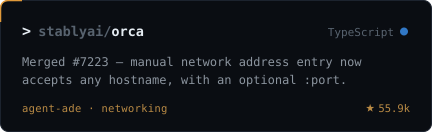
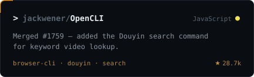
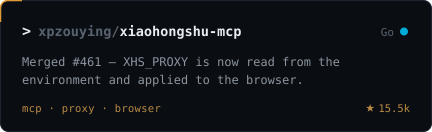
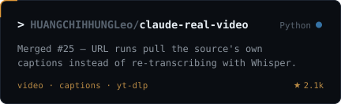
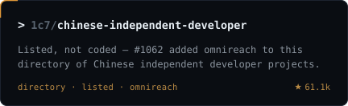

<!-- handcrafted SVG, zero third-party widgets — assets/ is the whole design -->

<samp>$ ls ~/ships --featured</samp>

<samp>$ ls ~/contributions --merged</samp>

<samp>$ ssh vault@daily-ac — permission denied · click to force entry</samp>

 

